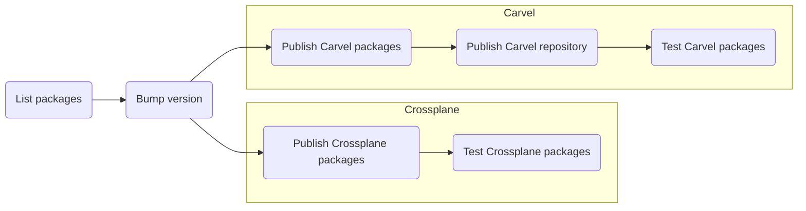

The code and configuration for the reference packages must be stored in the `packages` folder,
in a structure like the following:

```text
packages
├── <PROVIDER>
│   └── <PACKAGING>
│       └── <NAME>
│           ├── ...
│           ├── ...
┆           ┆
```

- `PROVIDER`: the provider the package is built for (i.e. `aws`, `azure`, `gcp`, `multicloud`).
- `PACKAGING`: the packaging system used (currently it must be either `carvel` or `crossplane`).
- `NAME`: the package name.

Multiple packages can be built and tested in parallel via the `publish-packages.yml` workflow, which is represented in the following diagram.



This workflow runs upon push to either `main` or `develop` branches as well as pull request events targeting the `main` branch.
Only the files matching the `packages/*/*/*/**` glob pattern can actually trigger the workflow: this reflects the packages structure described before
and prevents changes to files outside actual packages directories to trigger it.

## List packages

This job evaluates the differences since the previous commit and builds two lists of packages, for Carvel and Crossplane, to feed the following GitHub Actions matrix jobs with.

## Bump version

The repository is tagged with a new version, bumping the latest one by either the major, minor or patch fields.
Which field is increased depends on the git comment having any of the substrings `#major`, `#minor`, `#patch` (default is set to `patch`).
More info [here](https://github.com/anothrNick/github-tag-action/tree/1.57.0).

## Publish Carvel packages

The Carvel packages that have been changed from the previous commit are built in parallel and published to GitHub Packages using [Carvel's `kctrl`](https://carvel.dev/kapp-controller/docs/v0.43.2/kctrl-package-authoring/).
`kctrl` also produces packages metadata files that are needed to build Carvel's repository, which are then stored in a separate git branch for each package.

## Publish Carvel repository

The packages' metadata files produced in the previous job are collected into one single branch, where `kctrl` is used to author the actual Carvel repository publish it to GitHub Packages in OCI format.
The artefact produced by `kctrl` is a manifest file for the `PackageRepository` resource, useful for quickly deploying the repository on top of a kapp-enabled Kubernetes cluster.
This file is attached to a pre-release, which will then be used in the following job for testing the packages.

!!! note ""
    This Carvel repository is built for the sole purpose of testing the packages, thus a pre-release is created.
    The actual repository release is taken care of by a different workflow.

## Test Carvel packages

This phase aims at testing the Carvel packages, by spawning one job per package and running them in parallel on separate GitHub Actions runners.
Each job performs the following steps:

1. [install the Carvel suite](https://carvel.dev/#install)
1. create a [kind cluster](https://kind.sigs.k8s.io/)
1. [install kapp-controller](https://carvel.dev/kapp-controller/docs/v0.43.2/install/)
1. [install secretgen-controller](https://github.com/carvel-dev/secretgen-controller/blob/develop/docs/install.md)
1. install the Carvel repository published in the previous job
1. run a test script that adheres to a specific naming convention (`scripts/carvel-e2e-$PACKAGE_PROVIDER-$PACKAGE_NAME.sh`), in order to:

    1. install the cloud operator specific for the current package (i.e. [ACK](https://aws-controllers-k8s.github.io/community/docs/community/overview/), [ASO](https://azure.github.io/azure-service-operator/), ...)
    1. deploy the package with sample input data (need to consider also firewall rules to allow network traffic)
    1. deploy an application to consume the service provided via the package
    1. ingest data to the application
    1. assert the ingested data

1. clean up everything

## Publish Crossplane packages

Crossplane packages are built leveraging `ytt`, for dealing with templating, and the `up` CLI from Upbound, for building the packages and pushing them to an OCI registry (GitHub Packages).

## Test Crossplane packages

The testing phase reflects what is done on Carvel's side, which means:

1. create a [kind cluster](https://kind.sigs.k8s.io/)
1. install [Upbound's Universal Crossplane](https://github.com/upbound/universal-crossplane)
1. run a test script that adheres to a specific naming convention (`scripts/crossplane-e2e-$PACKAGE_PROVIDER-$PACKAGE_NAME.sh`), in order to:

    1. install the Crossplane provider(s) needed by the package
    1. install the Crossplane package
    1. create a claim in order to trigger the build of the actual managed resources
    1. deploy and test an application

1. clean up everything
